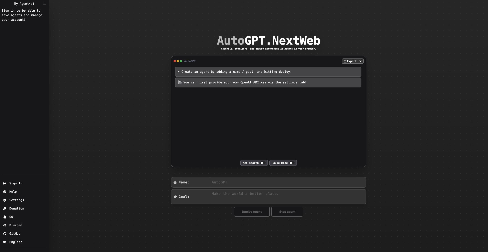

# AutoGPT-Next-Web

One-Click to deploy well-designed AutoGPT-Next-Web UI on Vercel.

[Demo](https://auto-agentgpt.com/) / [Issues](https://github.com/willdelg/AutoGPT-Next-Web/issues) / [Join Discord](https://discord.gg/Xnsbhg6Uvd) / [Buy Me a Coffee](https://www.buymeacoffee.com/newusername)

## Features

- Free one-click deployment with Vercel in 1 minute.
- Improved local support: After typing in Chinese, the content will be displayed in Chinese.
- UI designed to match AgentGPT, responsive design, and support for dark mode.
- Domain binding for quick access anywhere without barriers.
- Access code control for exclusive use.

## Roadmap

- [x] **Docker and Docker Compose Support (Completed May 2023):** Simplifies local setup using containers.
- [x] **Endpoint URL Customization (Completed June 2023):** Allows custom endpoint URLs for API management.
- [x] **Azure OpenAI API Integration (Completed July 2023):** Added support for Azure's OpenAI service.
- [ ] **Running Results Optimization (Expected by Q4 2023):** To enhance the UI for better result display.
- [ ] **WeChat Login Feature (Expected by Q1 2024):** To implement WeChat login for user convenience.

## Getting Started

To get started with AutoGPT-Next-Web, follow these steps:

1. Prepare your OpenAI API Key.
2. Click the deploy button above and follow the prompts.
3. For access control features, refer to the detailed tutorial linked below.

For a detailed setup guide, please refer to our [documentation](https://autogpt-next-web.gitbook.io/autogpt-next-web/).

## Docker Deployment

For detailed instructions on how to deploy AutoGPT-Next-Web using Docker, please refer to our [Docker Deployment Guide](./DOCKER.md).

## Local Development

For developers looking to contribute or customize AutoGPT-Next-Web, see our [Local Development Guide](./DEVELOPMENT.md).

## FAQ

For frequently asked questions, please check our [FAQ section](./FAQ.md).

## Contributing

We welcome contributions! Please see our [Contributing Guidelines](./CONTRIBUTING.md) for more information.

## License

AutoGPT-Next-Web is released under the [MIT License](./LICENSE).

